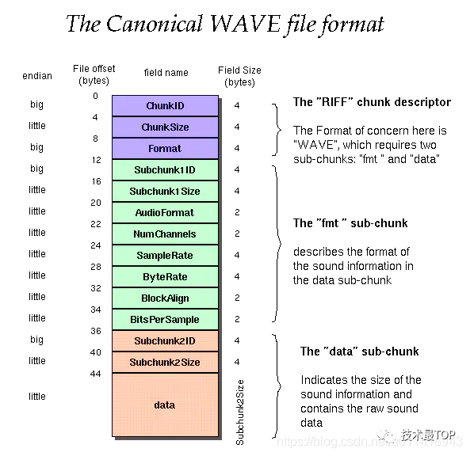

# PCM

Android SDK 提供了两套音频采集的API，分别是：MediaRecorder 和 AudioRecord，前者是一个更加上层一点的API，它可以直接把手机麦克风录入的音频数据进行编码压缩（如AMR、MP3等）并存成文件，而后者则更接近底层，能够更加自由灵活地控制，可以得到原始的一帧帧PCM音频数据


## 初始化获取每一帧的Size

这里采样率设置为44100HZ，采用双声道，音频格式为**16位PCM编码:ENCODING_PCM_16BIT**

```
int PCM_RATE = 44100
mRecordBufferSize = AudioRecord.getMinBufferSize(PCM_RATE
                , AudioFormat.CHANNEL_IN_STEREO 
                , AudioFormat.ENCODING_PCM_16BIT);
```

接着初始化AudioRecord

## AudioRecord

```
 mAudioRecord = new AudioRecord(MediaRecorder.AudioSource.MIC
                , PCM_RATE
                , AudioFormat.CHANNEL_IN_STEREO
                , AudioFormat.ENCODING_PCM_16BIT
                , mRecordBufferSize);
```

第一个参数audioSource 音频源。这里选择使用麦克风：**MediaRecorder.AudioSource.MIC**

第二个参数 采样率

第三个 参数 声道配置

第四个 参数 音频格式

第五个 参数 是之前设置的缓冲区大小


## 录制

```
private void startRecord(){
        pcmFile = new File(...);
        mWhetherRecord = true; //标志位
        
        new Thread(new Runnable() {
            @Override
            public void run() {
                mAudioRecord.startRecording();//开始录制
                
                FileOutputStream fileOutputStream = null;
                try {
                    fileOutputStream = new FileOutputStream(pcmFile);
                    byte[] bytes = new byte[mRecordBufferSize];
                    
                    while (mWhetherRecord){
                        mAudioRecord.read(bytes, 0, bytes.length);//读取流
                        fileOutputStream.write(bytes);
                        fileOutputStream.flush();
                    }
                    Log.e(TAG, "run: 暂停录制" );
                    mAudioRecord.stop();//停止录制
                    mAudioRecord.release();
                    fileOutputStream.flush();
                    fileOutputStream.close();
                    
                } catch (FileNotFoundException e) {
                    e.printStackTrace();
                    mAudioRecord.stop();
                } catch (IOException e) {
                    e.printStackTrace();
                }

            }
        }).start();
    }
```

调用startRecording后，通过AudioRecord#read将数据读入缓冲byte数组中。

为什么用布尔值,来关闭录制？有些小伙伴会发现AudioRecord是可以获取到录制状态的.那么肯定有人会用状态来判断while是否还需要处理流.这种是错误的做法.因为MIC属于硬件层任何硬件的东西都是异步的而且会有很大的延时.所以回调的状态也是有延时的,有时候流没了,但是状态还是显示为正在录制。


## 播放pcm

以通过 **AudioTrack** 来实现该功能，它为 Android 管理和播放音频的管理类，允许 PCM 音频通过write() 方法将数据流推送到 AudioTrack 来实现音频的播放。

AudioTrack 有两种模式：**流模式和静态模式**

`流模式：`在流模式，当使用 `write()` 方法时，会向 AudioTrack 写入连续的数据流，数据会从 Java 层传输到底层，并排队阻塞等待播放；在播放音频块数据时，流模式比较好用：

- 音频数据过大过长，无法存入内存时
- 由于音频数据的特性(高采样率，每采样位…)，太大而无法装入内存。
- 接收或生成时，先前排队的音频正在播放。

`静态模式：`静态模式，它需要一次性把数据写到buffer中，适合小音频，小延迟的音频播放，常用在UI和游戏中比较实用。


### 流模式

数据会从 Java 层传输到底层，并排队阻塞等待播放，所以，这里我们开启一个线程，读取数据后等待播放

#### 设置音频信息属性

```
           /**
             * 设置音频信息属性
             * 1.设置支持多媒体属性，比如audio，video
             * 2.设置音频格式，比如 music
             */
            AudioAttributes attributes = new AudioAttributes.Builder()
                    .setUsage(AudioAttributes.USAGE_MEDIA)
                    .setContentType(AudioAttributes.CONTENT_TYPE_MUSIC)
                    .build();
```

#### 设置音频格式

```
int channelConfig = AudioFormat.CHANNEL_IN_STEREO;
AudioFormat format = new AudioFormat.Builder()
                    .setSampleRate(PCM_RATE)
                    .setEncoding(AudioFormat.ENCODING_PCM_16BIT)
                    .setChannelMask(channelConfig)
                    .build();
```

#### 初始化AudioTrack后播放

```
bufferSize = AudioTrack.getMinBufferSize(PCM_RATE, channelConfig, AudioFormat.ENCODING_PCM_16BIT);

audioTrack = new AudioTrack(
                    attributes,
                    format,
                    bufferSize,
                    AudioTrack.MODE_STREAM,
                    AudioManager.AUDIO_SESSION_ID_GENERATE  ////音频识别id
            );
//播放，等待数据
audioTrack.play();
```

由于是流模式，所以大小只需要设置一帧的最小`buffer` 即可，然后调用 `play()` 方法去等待数据，当AudioTrack 的 `write()` 有数据到来时，就会播放音频

```
        @Override
        public void run() {
            super.run();
            File file = new File(PATH, "test.pcm");
            
            if (file.exists()) {
                FileInputStream fis = null;
                try {

                    fis = new FileInputStream(file);
                    byte[] buffer = new byte[bufferSize];
                    int len;
                    
                    while (!isDone && (len = fis.read(buffer)) > 0) {
                     // 写数据到 AudioTrack中，等到播放
                        audioTrack.write(buffer, 0, len);
                    }

                    audioTrack.stop();
                    audioTrack.release();

                } catch (Exception e) {

                } finally {
                    CloseUtils.close(fis);
                }

            }

        }
```


### 静态模式

与流模式类似，不过是一次性读入所有bytes

```
 AudioTrack audioTrack = new AudioTrack(
                    attributes,
                    format,
                    bytes.length,
                    AudioTrack.MODE_STATIC, //设置为静态模式
                    AudioManager.AUDIO_SESSION_ID_GENERATE //音频识别id
  );
            //一次性写入
audioTrack.write(bytes, 0, bytes.length);
            //开始播放
audioTrack.play();
```


# WAV

PCM转换位wav格式 ，只需要在pcm的文件起始位置加上至少44个字节的WAV头信息。主要pcmAudioByteCount为pcm文件的长度

```
private byte[] generateWavFileHeader(long pcmAudioByteCount, long longSampleRate, int channels) {
        long totalDataLen = pcmAudioByteCount + 36; // 不包含前8个字节的WAV文件总长度
        long byteRate = longSampleRate * 2 * channels;
        byte[] header = new byte[44];
        header[0] = 'R'; // RIFF
        header[1] = 'I';
        header[2] = 'F';
        header[3] = 'F';

        header[4] = (byte) (totalDataLen & 0xff);//数据大小
        header[5] = (byte) ((totalDataLen >> 8) & 0xff);
        header[6] = (byte) ((totalDataLen >> 16) & 0xff);
        header[7] = (byte) ((totalDataLen >> 24) & 0xff);

        header[8] = 'W';//WAVE
        header[9] = 'A';
        header[10] = 'V';
        header[11] = 'E';
        //FMT Chunk
        header[12] = 'f'; // 'fmt '
        header[13] = 'm';
        header[14] = 't';
        header[15] = ' ';//过渡字节
        //数据大小
        header[16] = 16; // 4 bytes: size of 'fmt ' chunk
        header[17] = 0;
        header[18] = 0;
        header[19] = 0;
        //编码方式 1为PCM编码格式
        header[20] = 1; // format = 1
        header[21] = 0;
        //通道数
        header[22] = (byte) channels;
        header[23] = 0;
        //采样率，每个通道的播放速度
        header[24] = (byte) (longSampleRate & 0xff);
        header[25] = (byte) ((longSampleRate >> 8) & 0xff);
        header[26] = (byte) ((longSampleRate >> 16) & 0xff);
        header[27] = (byte) ((longSampleRate >> 24) & 0xff);
        //音频数据传送速率,采样率*通道数*采样深度/8
        header[28] = (byte) (byteRate & 0xff);
        header[29] = (byte) ((byteRate >> 8) & 0xff);
        header[30] = (byte) ((byteRate >> 16) & 0xff);
        header[31] = (byte) ((byteRate >> 24) & 0xff);
        // 确定系统一次要处理多少个这样字节的数据，确定缓冲区，通道数*采样位数
        header[32] = (byte) (2 * channels);
        header[33] = 0;
        //每个样本的数据位数
        header[34] = 16;
        header[35] = 0;
        //Data chunk
        header[36] = 'd';//data
        header[37] = 'a';
        header[38] = 't';
        header[39] = 'a';
        header[40] = (byte) (pcmAudioByteCount & 0xff);
        header[41] = (byte) ((pcmAudioByteCount >> 8) & 0xff);
        header[42] = (byte) ((pcmAudioByteCount >> 16) & 0xff);
        header[43] = (byte) ((pcmAudioByteCount >> 24) & 0xff);
        return header;
    }
```

可以先空44个字节，完成pcm录制后再填充




补充说明 大小端

比如int value = 0x12345678 （0x12 高字节  0x78）

如果是小端，低字节放在内存的低地址 

高地址
---------------
buf[3] (0x12) -- 高位
　　buf[2] (0x34)
　　buf[1] (0x56)
　　buf[0] (0x78) -- 低位

--------------

低地址