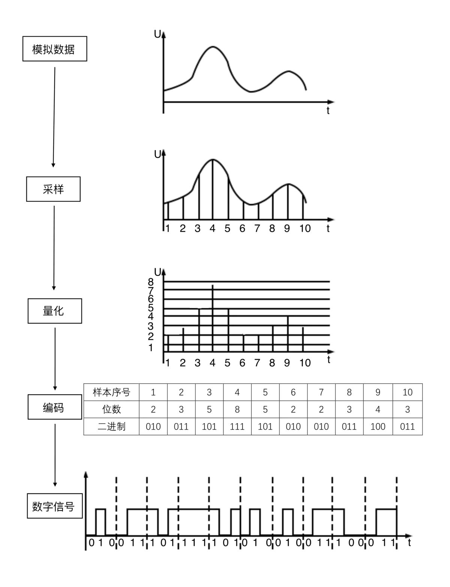

# 基础概念

声音是一种波，有自己的振幅和频率，如果要保存声音，就要保存各个时间点上的振幅。

对声音这种模拟信号，采用数字化，即转换成数字信号。

**音频数据的承载方式，最常用的就是 脉冲编码调制，即 PCM**

> 模拟信号 -> 采样 -> 量化 -> 编码 -> 数字信号

## 采样率

定义了每秒从连续信号中提取并组成离散信号的采样个数，它用赫兹（Hz）来表示。

采样频率的倒数是采样周期或者叫作采样时间，它是采样之间的时间间隔。

通俗的讲采样频率是指计算机每秒钟采集多少个信号样本。

在当今的主流采集卡上，采样频率一般共分为11025Hz、22050Hz、24000Hz、44100Hz、48000Hz五个等级，11025Hz能达到AM调幅广播的声音品质，而22050Hz和24000HZ能达到FM调频广播的声音品质，44100Hz则是理论上的CD音质界限，48000Hz则更加精确一些

在AudioFormat类里，采样率只能在4000到192000的范围内取值

```
public static final int SAMPLE_RATE_HZ_MIN = 4000; 最小4000
public static final int SAMPLE_RATE_HZ_MAX = 192000; 最大192000
```


## 采样位数

模拟信号是连续的样本值，而数字信号一般是不连续的，所以模拟信号量化，只能取一个近似的整数值，为了记录这些振幅值，采样器会采用一个固定的位数来记录这些振幅值，通常有 8 位，16位，32位。

位数越大，记录的值越准确，还原度越高。


## 声道数

支持能不同发声(注意是不同声音) 的音响的个数。

- 单声道：一个声道
- 双声道：2个声道
- 立体声：2个声道
- 立体声(4声道)：4个声道

```
在AudioFormat类，中定义了
public static final int CHANNEL_IN_LEFT = 0x4;//左声道
public static final int CHANNEL_IN_RIGHT = 0x8;//右声道
public static final int CHANNEL_IN_FRONT = 0x10;//前声道
public static final int CHANNEL_IN_BACK = 0x20;//后声道
public static final int CHANNEL_IN_LEFT_PROCESSED = 0x40;
public static final int CHANNEL_IN_RIGHT_PROCESSED = 0x80;
public static final int CHANNEL_IN_FRONT_PROCESSED = 0x100;
public static final int CHANNEL_IN_BACK_PROCESSED = 0x200;
public static final int CHANNEL_IN_PRESSURE = 0x400;
public static final int CHANNEL_IN_X_AXIS = 0x800;
public static final int CHANNEL_IN_Y_AXIS = 0x1000;
public static final int CHANNEL_IN_Z_AXIS = 0x2000;
public static final int CHANNEL_IN_VOICE_UPLINK = 0x4000;
public static final int CHANNEL_IN_VOICE_DNLINK = 0x8000;
public static final int CHANNEL_IN_MONO = CHANNEL_IN_FRONT;//单声道
public static final int CHANNEL_IN_STEREO = (CHANNEL_IN_LEFT | CHANNEL_IN_RIGHT);//立体声道(左右声道)
```



## 音频码率

码率就是数据传输时单位时间传送的数据位数,一般我们用的单位是**kbps**即千位每秒

码率高低直接影响音质，**码率高音质好，码率低音质差**

> 码率计算公式
>
> **码率=采样率 x 位深度 x 声道**

一个采样率为44.1KHz，采样大小为16bit，双声道的PCM编码的音频文件，它的码率则为 44.1K×16×2 =1411.2 Kbps。注意这边的单位是小b，单位是位。如果我们将单位转换为字节，则需要将码率除以8，就可以得到这个WAV的数据速率，即176.4KB/s。这表示存储一秒钟采样率为44.1KHz，采样大小为16bit，双声道的PCM编码的音频信号，需要176.4KB的空间，1分钟则约为10.34M，这对大部分用户是不可接受的，尤其是喜欢在电脑上听音乐的朋友，要降低磁盘占用，只有2种方法，降低采样指标或者压缩。降低指标是不可取的，因此专家们研发了各种压缩方案。

## 音频格式

常见的音频格式有MP3,WAV,AAC等

```
一般的手机设备可能只支持 16位PCM编码,如果其他的都会报错为坏值

public static final int ENCODING_PCM_16BIT = 2; //16位PCM编码
public static final int ENCODING_PCM_8BIT = 3; //8位PCM编码
public static final int ENCODING_PCM_FLOAT = 4; //4位PCM编码
public static final int ENCODING_AC3 = 5;
public static final int ENCODING_E_AC3 = 6;
public static final int ENCODING_DTS = 7;
public static final int ENCODING_DTS_HD = 8;
public static final int ENCODING_MP3 = 9; //MP3编码 此格式可能会因为不设备不支持报错
public static final int ENCODING_AAC_LC = 10;
public static final int ENCODING_AAC_HE_V1 = 11;
public static final int ENCODING_AAC_HE_V2 = 12;
```

## 音频压缩

### 有损压缩

就是消除冗余数据。音频采集过程中采集到各种各样的声音，只有一部分是人能识别出来的。其他的声音，我们直接删除掉。恢复回来的时候没有了，所以称为有损压缩。

### 无损压缩

哈夫曼无损压缩，利用数据的统计冗余进行压缩，可完全恢复原始数据而不引起任何数据丢失的，称为无损压缩。


